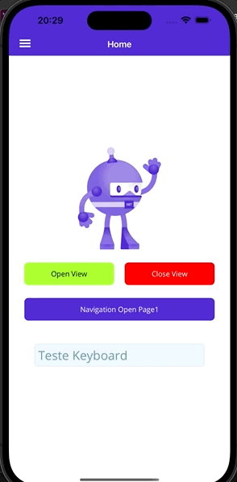

# Open View Maui with BottomSheet

A simple plugin to open a page on above of everything, it sits on top of the navigation and modules, with it you have the freedom to create a toast, popup, dialog, tips or window that opens over the entire application.

Thanks [lis](https://github.com/lisleitora) , [latinosamuel](https://github.com/latinosamuel) , [nuno](https://www.linkedin.com/in/nunomir/) , [flipper09112](https://github.com/flipper09112) , [LuckyDucko](https://github.com/LuckyDucko)
for inspiring this project.

The library consists of one NuGet packages:

[](https://www.nuget.org/packages/OpenViewMaui/)

[Sample](https://github.com/pabloprogramador/OpenViewMaui/tree/main/OpenViewMaui.Sample)

To use, simply install the package and add use to your builder:

```javascript
var builder = MauiApp.CreateBuilder();
    builder
      .UseMauiApp<App>()
      .UseOpenViewMaui()
```




You can use the OpenView:

```javascript
private OpenViewMaui.OpenView openView;

public MainPage()
	{
	InitializeComponent();
        openView = new OpenViewMaui.OpenView(new ItemPage(), value =>
        {
            pgText.Text = (string)value;
        });
    }

	private async void OnOpen(object sender, EventArgs e)
	{
		await openView.Show();
	}

    private async void OnClose(object sender, EventArgs e)
    {
        await openView.Hide();
    }

    private async void OnOpenPage1(object sender, EventArgs e)
    {
		await Shell.Current.GoToAsync(nameof(Page1));
    }

    private async void OnToast(object sender, EventArgs e)
    {
        var toast = new OpenViewMaui.OpenView(new ToastOpenView());
        await toast.Show();
    }

    async void OnOpenBottomSheet(System.Object sender, System.EventArgs e)
    {
        Action<object> callBack = value =>
        {
            pgText.Text = (string)value;
        };

        var bottomSheet = new BottomSheet(new MyList(), callBack);
        await bottomSheet.Show();
    }
```
